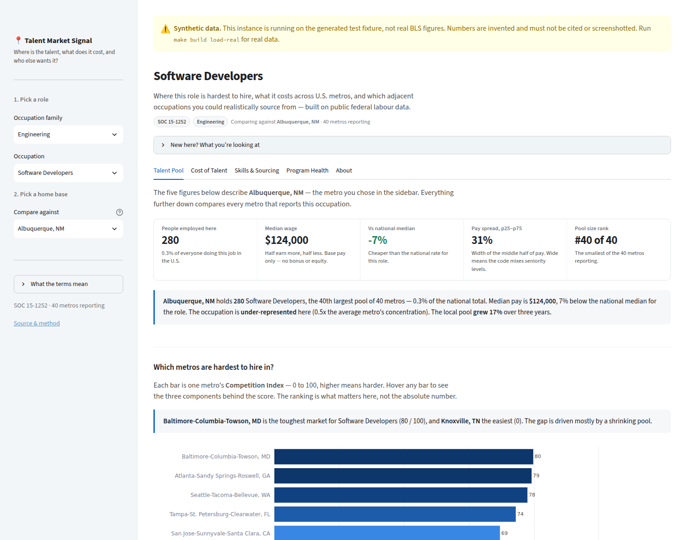
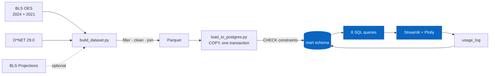
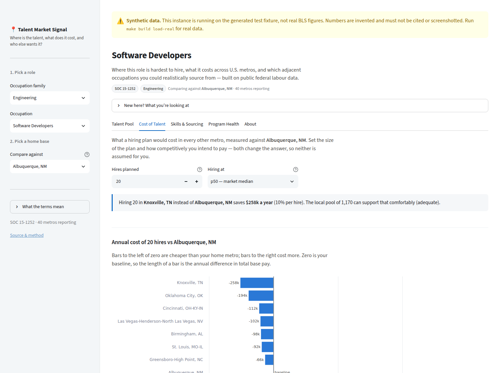
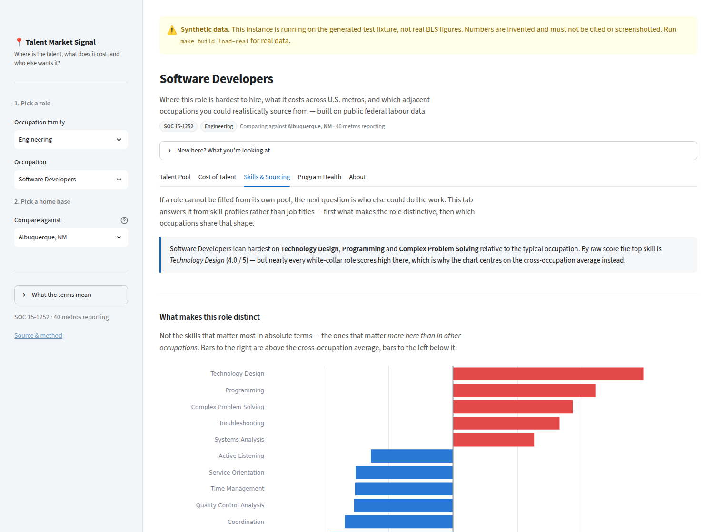

<div align="center">

# 📍 Talent Market Signal

**Where is the talent, what does it cost, and who else is competing for it?**

[](https://www.python.org/)
[](https://www.postgresql.org/)
[](https://streamlit.io/)
[](https://plotly.com/)
[](https://github.com/mateoportillo1900/talent-market-signal/actions)
[](LICENSE)

A labour-market insights product built on public U.S. federal data. It answers
the question a talent acquisition leader actually asks — *"we can't fill this
role, what do we do?"* — and it answers it in a sentence someone can repeat.

**[→ The PRD](docs/PRD.md)** &nbsp;·&nbsp; **[→ How it's measured](docs/MEASUREMENT.md)** &nbsp;·&nbsp; **[→ Methodology](docs/METHODOLOGY.md)** &nbsp;·&nbsp; **[→ All docs](docs/README.md)**

<br/>



<sub>Every view pairs its charts with a generated plain-English takeaway — the
end reader is a customer who never opens the tool. Running here on the
synthetic test fixture, which is why the banner is showing; it disappears
when real BLS data is loaded.</sub>

</div>

---

## At a glance

<table>
<tr>
<td align="center" width="25%">
<h3>63 × 150</h3>
<sub>OCCUPATIONS × METROS<br/><sup>configured scope; 10 families</sup></sub>
</td>
<td align="center" width="25%">
<h3>8</h3>
<sub>SQL QUERIES<br/><sup>all analysis, zero pandas logic</sup></sub>
</td>
<td align="center" width="25%">
<h3>174</h3>
<sub>TESTS<br/><sup>on real Postgres, every push</sup></sub>
</td>
<td align="center" width="25%">
<h3>7</h3>
<sub>PROGRAM DOCUMENTS<br/><sup>PRD · GTM · measurement</sup></sub>
</td>
</tr>
</table>

---

## Table of contents

- [Why I built this](#why-i-built-this)
- [The three insights](#the-three-insights)
- [Pipeline](#pipeline)
- [Dashboard](#dashboard)
- [Data](#data)
- [How it's built](#how-its-built)
- [The program layer](#the-program-layer)
- [Getting started](#getting-started)
- [What it cannot tell you](#what-it-cannot-tell-you)
- [What I'd build next](#what-id-build-next)

---

## Why I built this

Most analytics portfolios prove you can build a dashboard. An insights *function*
is judged on something harder: whether the insight reached a decision, and
whether anyone can tell.

So this project is deliberately two things.

**A working data product** — a Postgres warehouse, eight commented SQL queries
carrying every analytical measure, a five-view dashboard, and 174 tests, most
aimed at the failure mode that actually matters: a build that succeeds and
produces a confident, wrong number.

**The programme around it** — a PRD organised by customer lifecycle stage, a
rollout plan with gate criteria that can fail, a measurement plan that opens by
admitting what cannot be attributed, and a stakeholder map naming the four
conflicts I would expect.

The second half is the part most portfolios skip, and it is the part this kind
of role is actually about.

---

## The three insights

Supply and cost data tells a customer their market is tight. That is reporting.
These three turn it into something they can act on:

> **"Hiring 20 here instead of your HQ metro saves $258k a year."**
> The number a customer repeats to their CFO.

> **"But that market holds 1,170 people — only 23 realistic hires a year."**
> The guardrail. Sorting by saving alone puts the thinnest markets on top, and a
> plan to hire 20 people from a pool of 40 is worse than no plan. The tool
> refuses to make that recommendation.

> **"You can't find Software Developers? QA Analysts are the closest adjacent
> pool — 0.70 on skill similarity, with unusual strength in 9 of the same
> skills."**
> The one that changes what someone does on Monday.

That third insight is why this is not just a reporting tool — and it took a real
analytical decision to make it work. See [skill adjacency](#skill-adjacency-the-one-real-modelling-decision).

*(Figures above are from a run on the synthetic fixture, so they illustrate the
shape of the output rather than the state of the real labour market.)*

---

## Pipeline

<!-- diagram: pipeline -->


The loop back from the dashboard to `usage_log` is deliberate. Instrumentation
went in on the first commit, because adding it later means the first two
quarters are permanently unmeasurable.

---

## Dashboard


*Screenshots run on the synthetic test fixture — the warning banner is a
deliberate guard, and it disappears once real BLS data is loaded.*

Five views, each pairing charts with a **generated plain-English takeaway**. A
chart handed to someone who does not already know the answer is a puzzle, not an
insight — and the end reader here is a customer who never opens the tool.

| View | Answers |
|---|---|
| **Talent Pool** | Where is this role hard to hire, and why |
| **Cost of Talent** | What would N hires cost elsewhere — and is the talent actually there |
| **Skills & Sourcing** | What defines this role, and who else could do it |
| **Program Health** | Is anyone using this |
| **About** | Sources, method, and what the data cannot say |

<details>
<summary><b>Cost of Talent</b> — diverging bars, baseline pinned at zero</summary>


</details>

<details>
<summary><b>Skills & Sourcing</b> — distinctiveness, not raw importance</summary>


</details>

---

## Data

| Source | Vintage | Provides |
|---|---|---|
| **BLS OES**, metro | May 2024 | Employment + five wage percentiles per occupation × metro |
| **BLS OES**, metro | May 2021 | Prior vintage, for three-year supply growth |
| **BLS OES**, national | May 2024 | Per-occupation national median, the comparison anchor |
| **O\*NET** | 29.0 | Skill importance, 1–5 |
| **BLS Projections** | 2024–34 | Ten-year outlook *(optional — degrades gracefully)* |

All public domain or CC BY. No proprietary data, no personal data, no scraping.

Three years between OES vintages is deliberate: OES re-samples on a rolling
three-year cycle, so a one-year gap compares overlapping samples and understates
real movement.

---

## How it's built

### Analysis lives in SQL, not pandas

Every measure is a commented file in [`sql/`](sql/), using ANSI window functions
and CTEs. The same logic runs unchanged on Trino, Spark SQL, Snowflake or
BigQuery — Postgres is just what is free to host. pandas logic does not travel
that way.

### Skill adjacency — the one real modelling decision

O\*NET importance is a strictly positive 1–5 scale, so **raw cosine similarity
is useless here**: every occupation pair lands in a narrow band and the ranking
is dominated by which occupations score high on everything.

Mean-centring each skill first removes that shared baseline. Measured across all
62 other occupations against Software Developers:

| Measure | Range | Spread |
|---|---|---|
| Raw cosine | 0.8641 – 0.9775 | 0.1134 |
| **Mean-centred** | −0.4646 – 0.6964 | **1.1610** |

The usable range is about **10× wider**. Under raw cosine, the gap between the
3rd and 30th best sourcing candidate is smaller than the noise in the underlying
O\*NET ratings, so the ranking is confident and meaningless.

*(Measured on the synthetic fixture, whose occupations are generated from group
templates and separate more cleanly than real O\*NET data will. The compression
problem is a property of the measure, not the fixture; the exact numbers move.)*

### Bad data fails the load, it doesn't reach a chart

`CHECK` constraints in [the DDL](sql/ddl/schema.sql) reject an inverted wage
percentile or an off-scale O\*NET rating at load time, and the load runs in one
transaction — so a violation leaves the previous data live rather than half
replaced.

BLS suppression markers all become null. `#` means *"wage at or above
$115,000"* — a **censored** value, not a missing one. Substituting the threshold
would invent a number and bias precisely the high-wage occupations this project
is about.

### Query performance is shown, not claimed

```
Bitmap Heap Scan on talent_market  (rows=40)
  Recheck Cond: (soc_code = '15-1252')
  ->  Bitmap Index Scan on talent_market_soc_idx
```

`python scripts/explain_queries.py` prints the plan for every query. An index
seek to 40 of 2,520 rows, not a scan.

### The tests target silent wrongness

Not "does it return rows" — the failure that reaches a customer:

| Test | Catches |
|---|---|
| `test_scarcity_is_inverse_to_supply` | A sign flip that would rank the *easiest* metros as the hardest |
| `test_baseline_metro_has_zero_delta` | A join anchoring every saving to the wrong metro |
| `test_percentile_choice_changes_the_answer` | A selector that silently stops changing anything |
| `test_pool_summary_direction_matches_the_wage_premium` | A narrative saying "below" when the number is above |
| `test_findings_render_as_html_not_literal_markdown` | Markdown reaching the screen as literal `**asterisks**` |

CI runs all 174 against a real `postgres:16` container, using the same loader
that loads real data — so the constraints are exercised on every push. A
separate manual workflow runs the same suite against the live Neon database.

---

## The program layer

Seven documents, indexed in **[docs/](docs/README.md)**. Each names an owner and
a date, labels its judgment calls as judgment calls, and carries a Mermaid
diagram that GitHub renders inline.

| Document | What's in it |
|---|---|
| [**PRD**](docs/PRD.md) | Jobs-to-be-done by lifecycle stage. Explicit non-goals |
| [**Measurement**](docs/MEASUREMENT.md) | Three confidence tiers, and why win-rate lift is **not** cleanly attributable |
| [**GTM & enablement**](docs/GTM_ENABLEMENT.md) | 4-week pilot, gate criteria that can fail, a one-page cheat sheet |
| [**Stakeholder map**](docs/STAKEHOLDER_MAP.md) | RACI, and the four conflicts I'd expect |
| [**Data quality**](docs/DATA_QUALITY.md) | Fatal / warn / note tiers. Fatal beats availability |
| [**Methodology**](docs/METHODOLOGY.md) | Every formula, every judgment call named as one |
| [**AI-assisted development**](docs/AI_ASSISTED_DEVELOPMENT.md) | What the assistant got wrong, and how each was caught |

That last document is the one I would open first. This was built with an AI
assistant, and it produced five confident errors — a fabricated example, an
unverified query-plan claim, banker's rounding in a money formatter, a null type
that broke the most common path, and four rendering bugs no unit test could see.
Each is documented with how it was caught.

**The rule that came out of it:** if a comment states a fact, there must be a
command that produced it.

---

## Getting started

**Prerequisites:** Python 3.12, and any Postgres ([Neon](https://neon.tech)'s
free tier is what this was built against — use the **direct** connection
string, not the pooled one; [`.env.example`](.env.example) explains why).

```bash
git clone https://github.com/mateoportillo1900/talent-market-signal.git
cd talent-market-signal
make install

cp .env.example .env          # paste your DATABASE_URL
```

**Try it immediately, no downloads:**

```bash
make fixture load run         # synthetic data, then the dashboard
```

**Or build the real thing:**

```bash
make check                    # 10s — are the source URLs alive?
make build                    # ~10 min first run, then cached
make load-real run
```

```bash
make test                     # 174 tests
make lint
make explain                  # query plans
```

`make` on its own lists every target. There is no workflow hidden in a
maintainer's shell history.

Run `--check` first. If BLS has moved a download path — they reorganise between
vintages — you get a named URL and one file to edit, rather than a stack trace
ten minutes in.

---

## What it cannot tell you

Stated here, in the app, and in [the methodology](docs/METHODOLOGY.md), because a
caveat that lives only in the docs is a caveat nobody reads.

- **Public data lags.** OES is a year or more behind. It describes the market
  that was, not the one you are hiring in this quarter.
- **SOC codes are not job titles.** "Software Developers" spans an enormous
  range of seniority in one bucket — which is why wage dispersion is surfaced
  rather than buried.
- **There is no company dimension.** Public data cannot say which employers
  compete for a pool. This is the most-requested thing it cannot do.
- **Nothing here is causal.** These are descriptive market statistics.
- **Adjacency is about skills, not credentials.** Two occupations sharing a
  skill profile does not mean a hiring manager agrees they are substitutable.

---

## What I'd build next

**An employer dimension.** The single biggest gap. H-1B LCA disclosure filings
give employer × title × wage × location and would answer the question this
cannot.

**Push, not pull.** The highest-value version of this is not a dashboard anyone
visits. It is a notification: *"the talent pool your customer relies on shrank
8% this quarter."* Pull tools get used by the already-curious; push reaches
everyone else.

**And at real scale** — this is a 2,520-row table on free-tier Postgres. On a
Hadoop-scale warehouse I would partition by occupation and precompute the
percentile ranks into a scheduled aggregate rather than recomputing them per
request. The SQL is written to port; the scale is not something I would pretend
to have solved here.

---

## License

[MIT](LICENSE). Data is public domain (BLS) and CC BY 4.0 (O\*NET).
