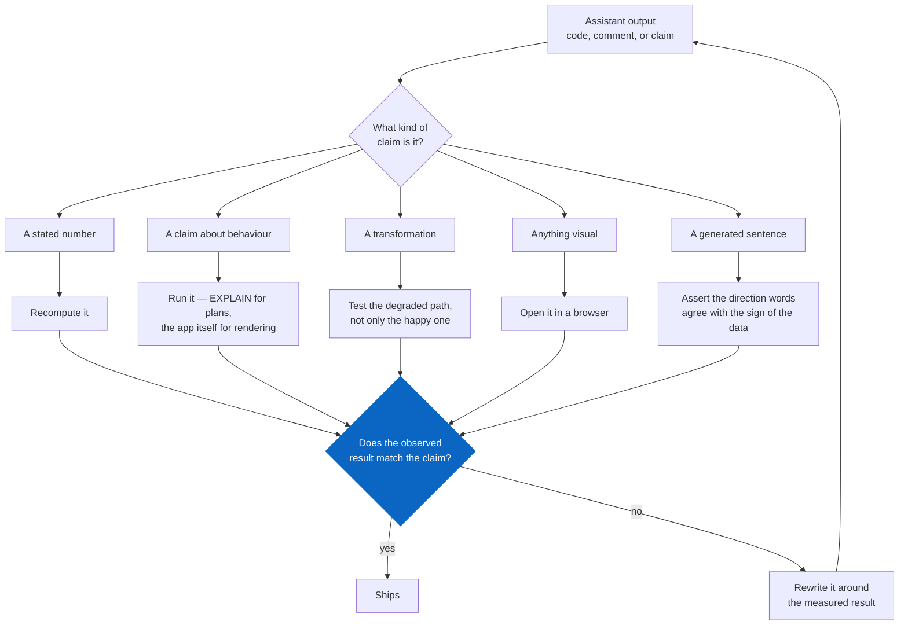

# Building this with an AI assistant

**Owner:** Mateo Portillo · **Last updated:** August 2026

The job description asks for someone who will *"use AI coding assistants (e.g.,
Claude, Copilot) to accelerate query development, debug pipelines, and prototype
analyses faster — while applying sound judgment to validate outputs for
accuracy."*

This project was built that way. This document is the second half of that
sentence: what the assistant got wrong, and how each one was caught.

---

## Where it genuinely accelerated things

**Boilerplate with a known shape.** Connection handling, argument parsing,
Parquet round-trips, the Streamlit layout. Well-trodden, low-risk, and fast.

**SQL scaffolding.** Getting a five-CTE query structurally correct on the first
pass — the CTE chain, the window functions, the join order. The *logic* still
needed deciding; the syntax did not need typing.

**Adversarial review of my own design.** The most valuable use, and the least
obvious. Asking "what would make this number wrong in a way nobody notices?"
produced the test list that became `test_metrics.py`.

**Test enumeration.** Given a function, generating the edge cases — empty
frames, single rows, zero denominators — is something an assistant does more
thoroughly than I do at the end of a long session.

---

## What it got wrong

Five errors, all of them confident, all caught by verification rather than by
reading. This is the actual content of the document.

### 1. A fabricated illustrative example

A comment in `sql/skill_adjacency.sql` explained why raw cosine similarity is
the wrong measure, and illustrated it with: *"raw cosine puts Registered Nurses
near Data Scientists."*

Plausible, well-phrased, and **untrue**. Checking it: Registered Nurses ranks
41st of 62 under raw cosine — nowhere near the top.

The underlying claim held. Raw cosine compresses all 62 occupations into
0.864–0.978; mean-centring widens that to −0.465–0.696, about ten times more
discriminating. The *argument* was right and the *example* was invented.

**Caught by:** computing both and comparing, rather than accepting an
explanation that read well. The comment now carries the measured figures.

**The lesson:** an assistant's supporting examples are the least reliable part of
otherwise-correct reasoning, because they are generated to be persuasive rather
than retrieved from anything.

### 2. An unverified claim about a query plan

A docstring asserted the adjacency query contained no nested loop. Running
`EXPLAIN` showed one — correctly, it is the `CROSS JOIN` of a single-row CTE.
The same script also reported sequential scans as failures, which is wrong for a
2,205-row table read in full by design.

**Caught by:** running the script instead of trusting its own description.

### 3. Banker's rounding in a money formatter

`$12,500` rendered as `$12k`. Python rounds half to even, so `$13,500` rendered
as `$14k`. Both individually defensible, inconsistent side by side, and awkward
to defend when someone checks the arithmetic in a sentence they are about to
repeat to a customer.

**Caught by:** a parametrised test written before the implementation was
examined.

### 4. `pandas.NA` where a float was required

The build script filled `proj_growth_10y` with `pd.NA` when the optional
projections source was unavailable. `NAType` does not survive the cast to the
schema's `float64` contract.

That path is the **common** one — the optional source is the one most likely to
404 — so the first real run of the pipeline would have crashed.

**Caught by:** a test for the degraded path, not the happy path.

### 5. Four rendering bugs invisible to the test suite

Found only by driving the running app in a browser:

- Generated takeaways render inside a styled HTML block, where Streamlit does no
  markdown processing — every `**metro name**` reached the screen as literal
  asterisks.
- Plotly renders `title=None` as the literal string `undefined` above the plot.
- The cost chart trimmed to the cheapest and priciest metros, which sliced out
  the baseline whenever it sat mid-range — a chart of differences with nothing
  marking what they were differences *from*.
- Bar labels clipped at the plot edge. A wider margin does not fix it; the axis
  range has to extend past the longest bar.

**Caught by:** opening the thing. Every unit test passed throughout.

---

## The validation practice, generalised

What the five errors have in common: none would have been caught by reading the
code, and all were caught by making the code produce an observable result.

<!-- diagram: ai-validation-loop -->

Note what is missing: there is no path from *"the explanation reads well"* to
**Ships**. All five errors below read well. Four of them passed every unit test.

| Category | How it is verified |
|---|---|
| A stated number | Recompute it. Every figure in a comment traces to a command that produced it |
| A claim about behaviour | Run it. `EXPLAIN` for plans, the app for rendering |
| A transformation | Test the degraded path, not just the happy one |
| Anything visual | Open it in a browser. Unit tests cannot see a layout |
| A generated sentence | Assert the direction words agree with the sign of the data |

**The single rule:** if a comment states a fact, there must be a command that
produced it. Everything else is a hypothesis wearing a declarative sentence.

---

## Where I would not use it

**Choosing the measure.** Whether to mean-centre the cosine similarity is a
judgment about what makes a *useful sourcing recommendation* — it needs to be
owned by someone who can defend it to a customer, not delegated.

**Deciding what is honest.** Whether `#` becomes null or $115,000, whether a
saving figure may exclude benefits, whether a tier-3 metric may be reported
without its caveat. These are judgment calls with reputational consequences, and
an assistant will produce a confident answer to each of them with no stake in
being right.

**Anything I could not explain in a review.** If I could not walk someone
through why the code does what it does, it does not go in — regardless of
whether it works.

---

## What this cost, honestly

The assistant made the build perhaps three times faster. Verification took back
maybe a third of that.

The net is a clear win, but the shape matters: **the acceleration is in
production, and the discipline has to be in verification.** Someone who takes
the speed-up without the verification tax ships faster and is wrong more often,
which in an insights function is strictly worse than being slow.

---

**[← All documentation](./README.md)** · [Project README](../README.md) · Related: [Data quality](./DATA_QUALITY.md) · [Methodology](./METHODOLOGY.md)
