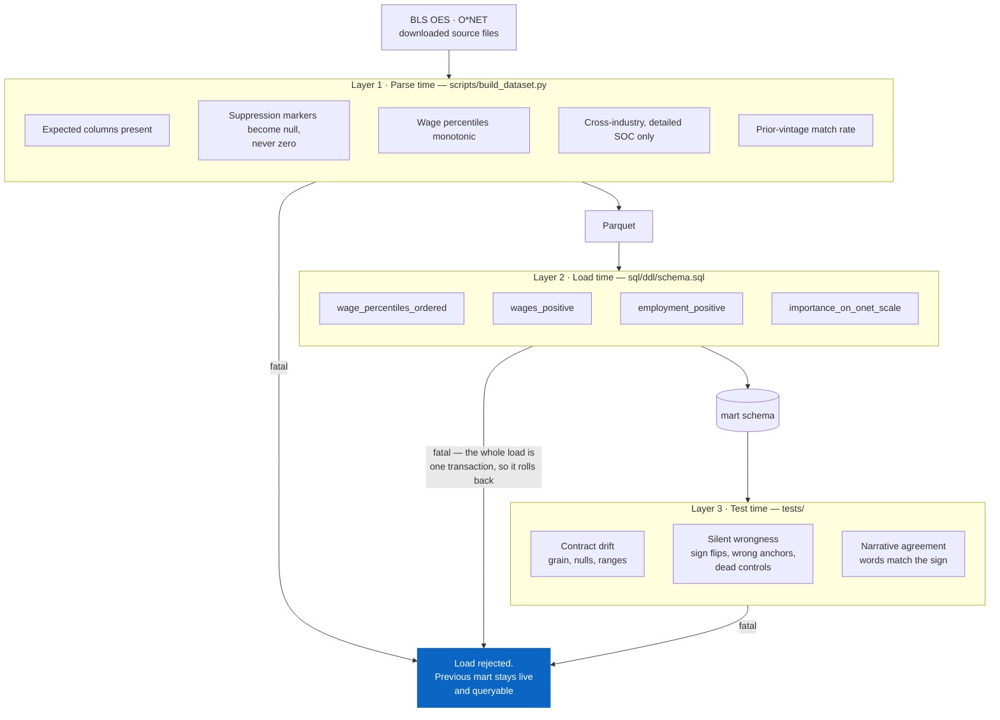

# Data quality and governance

**Owner:** Mateo Portillo · **Last updated:** August 2026

The failure mode this project is built against is not a crash. It is a build
that succeeds and produces a confident, wrong number that reaches a customer.

A pipeline that breaks is annoying for an afternoon. A pipeline that quietly
mis-parses a column produces charts that look fine, get screenshotted, get
repeated, and are discovered three weeks later by the customer.

---

## Severity tiers

Every check is assigned a tier, and the tier determines what happens.

| Tier | Meaning | Action | Example |
|---|---|---|---|
| **Fatal** | The number would be wrong and nobody would notice | **Reject the load.** Previous data stays live | Wage percentiles out of order |
| **Warn** | Suspicious, could be legitimate | Load, log, surface in the UI | 40% of metros missing prior-year data |
| **Note** | Expected, must stay visible | Load, mark in the interface | BLS suppressed this cell |

**Fatal beats availability.** A stale mart that is correct is better than a fresh
mart that is wrong — you can explain a delay; you cannot un-say a number.

---

## Where each check runs

Three layers, deliberately. Each catches things the others cannot.

<!-- diagram: data-quality-layers -->


Each layer catches what the one before it structurally cannot. Parse-time checks
can name the cause because they sit next to the source file. Database constraints
hold no matter what wrote the data — including a future loader nobody has written
yet. Tests catch the errors that are *arithmetically valid*: a scarcity score
with a flipped sign violates no constraint and passes every parse check.

### 1. Parse time — `scripts/build_dataset.py`

Nearest to the source, so failures name the cause.

| Check | Tier | Rationale |
|---|---|---|
| Expected columns present | Fatal | BLS renames columns between vintages. Missing ones would silently produce a short table |
| Suppression markers → null | Fatal | `*`, `**`, `#`, `~` must never become `0`. A suppressed wage read as zero drags averages down and looks like a cheap metro, not an error |
| Wage percentiles monotonic | Fatal | Crossed columns still look like wages |
| Cross-industry rows only | Fatal | Otherwise occupations count once per industry and employment multiplies |
| Detailed SOC level only | Fatal | `major` rows are parents; including them double-counts |
| Prior-vintage match rate | Warn | Metro boundaries get redefined. A low rate is expected; a collapse means the join key changed |
| Employment below the floor | Note | Estimates below 50 carry intervals too wide to rank |

### 2. Load time — `sql/ddl/schema.sql`

Database constraints, so they hold no matter what wrote the data.

```sql
CONSTRAINT wage_percentiles_ordered CHECK (...)
CONSTRAINT wages_positive           CHECK (wage_p50 > 0)
CONSTRAINT employment_positive      CHECK (employment > 0)
CONSTRAINT importance_on_onet_scale CHECK (importance BETWEEN 1.0 AND 5.0)
```

The whole load runs in **one transaction**. A violation rolls back and the
previous mart stays queryable. A half-loaded mart that still answers queries is
worse than no mart, because nothing about it looks broken.

### 3. Test time — `tests/`

| Suite | Guards against |
|---|---|
| `test_schema.py` | Contract drift: grain, nulls, ranges, label mismatches |
| `test_metrics.py` | Silent wrongness: sign flips, wrong join anchors, dead controls |
| `test_build_dataset.py` | Parser regressions, against files in the documented BLS shape |
| `test_narrative.py` | Generated sentences contradicting their own charts |
| `test_usage.py` | Telemetry that inflates its own counts |

CI runs all of them against a real `postgres:16` container on every push, using
the same loader that loads real data. The constraints above are therefore
exercised continuously, not just when someone remembers to run a build.

---

## The tests that earn their keep

Not the ones that check the code works. The ones that check it is not
*confidently wrong*:

**Scarcity sign.** `test_scarcity_is_inverse_to_supply` asserts the correlation
between supply and scarcity score is strongly negative. A flipped sign still
produces valid-looking 0–100 scores — and would rank the easiest metros as the
hardest, sending a customer to build a team in the worst possible city.

**Baseline anchor.** `test_baseline_metro_has_zero_delta` asserts the metro being
compared against costs exactly nothing extra. If that join picks up the wrong
row, every saving on the page is measured from the wrong place, and all of them
look plausible.

**Dead controls.** `test_percentile_choice_changes_the_answer` asserts p25 and
p75 return different wages. If the `CASE` stops matching, the percentile
selector becomes a decorative control that changes nothing — and no error is
raised.

**Narrative agreement.** `test_pool_summary_direction_matches_the_wage_premium`
asserts "above" and "below" track the sign of the number. A flipped comparator
reads perfectly fluently while telling a customer a market is cheap when it is
expensive.

---

## Handling suppressed and missing data

BLS suppresses cells it cannot publish, with four markers meaning four different
things. All become null. One deserves explanation:

**`#` means "wage at or above $115,000"** — a *censored* value, not a missing
one. We know it is high; we do not know how high.

Substituting $115,000 would be inventing a number, and it would bias precisely
the high-wage occupations this project is about. It stays null and the chart
shows a gap.

Where a gap would materially change a ranking, the value is imputed **and
flagged**: `growth_imputed` marks any three-year growth filled with the
occupation's median, and the UI footnotes it. An imputed number that is not
marked is indistinguishable from a measured one, which is how a caveat gets lost
between the analyst and the customer.

---

## What is deliberately not checked

Naming the gaps is part of the governance:

- **No freshness check.** The vintage is pinned in `scripts/sources.py` and
  updated by hand. A monthly source would need automated staleness detection;
  an annual one does not.
- **No row-count anomaly detection.** At 63 occupations the eyeball check in the
  build output is sufficient. At a thousand it would not be.
- **No lineage tooling.** The dependency graph is five SQL files. `dbt` would be
  ceremony at this size.
- **No PII handling.** There is none. Every source is aggregated public data
  with no individual records, which removes a whole class of obligation — and
  is worth stating rather than assuming.

---

## A constraint worth knowing: BLS blocks datacenter IPs

`scripts/build_dataset.py` cannot run on a cloud runner. Measured, not
assumed — from a single GitHub Actions job, in the same second:

```
[HTTP 403] OES metro (current)   (GET)
[HTTP 403] OES metro (prior)     (GET)
[HTTP 403] OES national          (GET)
[    OK ] O*NET database  13 MB  (HEAD)
```

O\*NET served fine from the same machine. BLS refused every request
regardless of method or User-Agent — a browser User-Agent and a ranged GET
were both tried and both refused.

403 is refusal, not absence. The files exist; BLS declines requests from
datacenter address ranges, which rules out GitHub Actions, Codespaces and
every hosted notebook. **The build has to run from a residential or office
connection.**

`--check` now recognises this signature — some hosts 403 while others serve
from the same machine — and says so, rather than leaving the next person to
hunt for a URL that never moved.

The load step is unaffected: once the Parquet exists, anything that can
reach Postgres can load it.

## Incident response

If a wrong number reaches a customer:

1. **Correct it the same day.** Directly, to whoever received it.
2. **Root-cause before re-enabling.** Not "which query" — *which check should
   have caught this and did not*.
3. **Add the test, then fix the bug.** In that order, so the test is proven to
   fail first.
4. **Say so in the monthly report.** A quietly-fixed error is a trust liability
   the second time it is discovered.

[`MEASUREMENT.md`](./MEASUREMENT.md) lists corrections as a **zero-tolerance guardrail**. Not because
mistakes are unforgivable, but because the field will correctly stop using a tool
that has embarrassed them once, and no amount of adoption work recovers that.

---

<sub>**[← All documentation](./README.md)** · [Project README](../README.md) · Related: [Methodology](./METHODOLOGY.md) · [AI-assisted development](./AI_ASSISTED_DEVELOPMENT.md)</sub>
