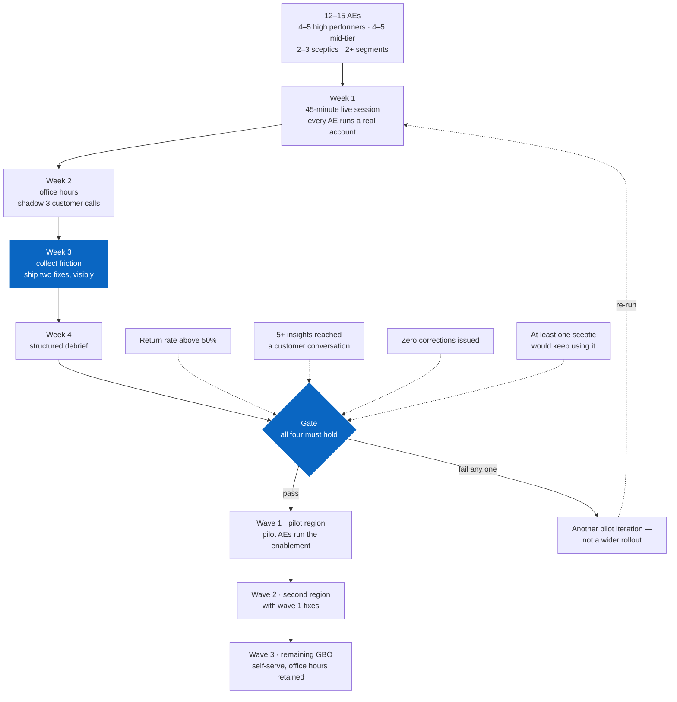

# Rollout and enablement

**Owner:** Mateo Portillo · **Last updated:** August 2026

How this gets from "built" to "used". The build is the easy half; most internal
insight tools die here, not in development.

---

## Why tools like this fail

Worth naming before proposing anything, because the plan is shaped around
avoiding these specifically:

1. **Launched to everyone at once.** No feedback loop, no early fixes, and one
   bad first impression across the whole field at the same moment.
2. **Trained on features, not moments.** People learn which buttons exist and
   still do not know when to open it.
3. **No owner after launch week.** Questions go unanswered, the tool visibly
   rots, and the field concludes it was a project rather than a product.
4. **Measured by attendance.** "94% of AEs completed training" is not adoption.

---

## Phase 1 — Pilot (4 weeks, 12–15 AEs)

**Why 12–15:** small enough that every user can be spoken to individually, large
enough that a 40% activation rate is not two people.

**Cohort selection matters more than cohort size.** Recruiting volunteers gives
you the enthusiasts, and their feedback will tell you the tool is great. Pick a
deliberate mix:

- 4–5 high performers (does it help someone already good?)
- 4–5 mid-tier (the population that actually determines value)
- 2–3 sceptics (they find the thing that breaks in front of a customer)
- Spread across at least two segments

**Stage it by region.** Not for logistics — so that the untouched regions form a
natural comparison group. That decision has to be made now, before launch,
because it cannot be recovered afterwards. See [`MEASUREMENT.md`](./MEASUREMENT.md).

<!-- diagram: pilot-and-gate -->

**The gate is drawn as a decision because it can genuinely fail.** A gate whose
only outcome is "proceed" is a milestone wearing a diamond, and a tool rolled
out on weak signal is far harder to withdraw than one that never launched.

### Week by week

| Week | Focus | Success looks like |
|---|---|---|
| 1 | 45-min live session; each AE runs one query on a real account | Everyone leaves having seen their own data |
| 2 | Office hours; shadow 3 customer calls | At least one insight used unprompted |
| 3 | Collect the friction; ship fixes | Two changes shipped from feedback, visibly |
| 4 | Structured debrief; gate decision | A go/no-go with evidence behind it |

Shipping a visible fix in week 3 is the highest-leverage act in the pilot. It
converts users into contributors, and the fastest way to kill feedback is to
collect it and do nothing.

### Gate criteria

Proceed to phase 2 only if:

- **Return rate > 50%** — see [`MEASUREMENT.md`](./MEASUREMENT.md) on why this and not activation
- **At least 5 concrete instances** of an insight reaching a customer conversation
- **Zero corrections** issued for a wrong number
- **At least one sceptic** would keep using it

Fail any of these and the answer is another pilot iteration, not a wider
rollout. A tool rolled out on weak signal is much harder to withdraw than one
that never launched.

---

## The enablement session

45 minutes. Not a feature tour.

| Time | Content |
|---|---|
| 0–5 | The problem, in their words. Play a real call recording where an AE gets asked a market question and has nothing |
| 5–15 | **One end-to-end story.** A single account, from question to insight to the sentence they would say |
| 15–30 | **Hands on their own accounts.** Everyone opens a real customer, finds one thing they did not know |
| 30–40 | What it cannot tell you, and how to say so |
| 40–45 | Where to get help, and who to complain to |

**The 15–30 block is the session.** Everything else is framing. Nobody adopts a
tool they have only watched someone else use.

The 30–40 block is not a disclaimer slide. An AE who confidently repeats a
number outside its limits will get corrected by a customer, and will never open
the tool again. Teaching the limits is teaching the tool.

---

## The one-page cheat sheet

What the field actually keeps. One page, three moments:

> **Before a QBR** — Talent Pool for their top 2 roles. One line:
> *"Your market for X is in the Nth percentile for difficulty nationally."*
>
> **When they say they cannot hire** — Skills & Sourcing. One line:
> *"Y shares most of the skill profile. Have you looked there?"*
>
> **When they push back on cost** — Cost of Talent, with pool depth.
> *"Metro Z is N% cheaper and deep enough to support your plan."*
>
> **Never say:** which companies are hiring (we don't have it) · total
> compensation (base wages only) · anything about this quarter (data lags 12–18
> months).

The "never say" block is the most important part and the reason the sheet is one
page. A three-page reference gets filed; a one-pager stays open in a tab.

---

## Phase 2 — Scaled rollout

Only after the gate passes.

| Wave | Who | Approach |
|---|---|---|
| 1 | Pilot region, full team | Pilot AEs run the enablement. Peers are more persuasive than programme managers |
| 2 | Second region | Same, with fixes from wave 1 |
| 3 | Remaining GBO | Self-serve enablement, live office hours retained |

**Retain office hours permanently.** It is a standing hour a week and it is the
main channel through which you learn what is actually breaking. Cancelling it is
how a product becomes an artefact.

---

## Sustaining it

| Ritual | Cadence | Purpose |
|---|---|---|
| Office hours | Weekly | Support, and the best source of roadmap signal |
| "Insight of the month" | Monthly | One real example, named AE, real outcome. Recognition drives adoption harder than training |
| Top-requests review | Monthly | `usage_top_requests` decides where depth goes next |
| Data refresh notice | Per vintage | Announce the new BLS release. Silence reads as staleness |
| Limits refresher | Quarterly | Teams turn over; the caveats have to be re-taught |

---

## What I would want from each partner

Named here so the asks are explicit rather than assumed. Detail in
[`STAKEHOLDER_MAP.md`](./STAKEHOLDER_MAP.md).

- **Sales leadership** — name the pilot cohort, and say publicly that using it
  is expected. Optional tools get optional adoption.
- **Sales readiness** — 45 minutes in an existing forum, not a new meeting.
- **Product marketing** — pressure-test the language. If it does not survive
  PMM, it will not survive a customer.
- **Data science** — review the Competition Index weights. A composite nobody
  senior has blessed is a composite nobody will defend for you.
- **Legal** — confirm the public-data positioning before anything reaches a
  customer-facing deck.

---

**[← All documentation](./README.md)** · [Project README](../README.md) · Related: [Measurement](./MEASUREMENT.md) · [Stakeholders](./STAKEHOLDER_MAP.md)
