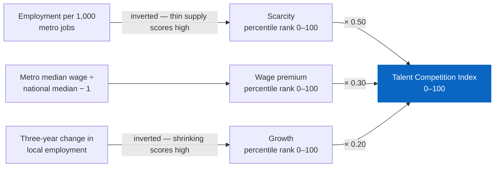
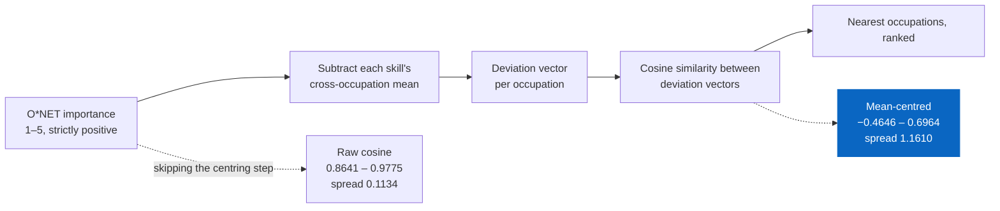

# Methodology

**Owner:** Mateo Portillo · **Last updated:** August 2026

How every number is computed, why each judgment call went the way it did, and
what the data cannot support.

---

## Sources

| Source | Vintage | What it provides | Licence |
|---|---|---|---|
| **BLS OES**, metro | May 2024 | Employment and five wage percentiles per occupation × MSA | Public domain |
| **BLS OES**, metro | May 2021 | Prior vintage, for three-year supply growth | Public domain |
| **BLS OES**, national | May 2024 | Per-occupation national median, the comparison anchor | Public domain |
| **O\*NET** database | 29.0 | Skill importance ratings, 1–5 scale | CC BY 4.0 |
| **BLS Employment Projections** | 2024–34 | Ten-year national outlook (optional) | Public domain |

Three years between OES vintages is deliberate. OES re-samples on a rolling
three-year cycle, so a one-year gap compares heavily overlapping samples and
understates real movement.

**Scope:** 63 white-collar occupations across 10 families, top 150 metros by
in-scope employment. BLS publishes ~830 SOC codes; most are irrelevant to a
talent-solutions audience and would make the picker unusable.

---

## Talent Competition Index

**Question:** rank every metro by how hard this occupation is to hire.

Three signals, each converted to a 0–100 percentile rank across the metros in
scope, then combined:

<!-- diagram: competition-index -->


Every component becomes a percentile rank *before* the weights are applied, which
is what makes the composite bounded by construction rather than by clamping.

| Component | Weight | Direction | What it captures |
|---|---|---|---|
| Scarcity | **0.50** | Thin supply → high | Employment per 1,000 metro jobs, inverted |
| Wage premium | **0.30** | High premium → high | Metro median ÷ national median − 1 |
| Growth | **0.20** | Shrinking → high | Three-year change in local employment |

### Why percentile rank, not z-score or min-max

BLS employment is severely long-tailed — New York has roughly 40× the software
developers of Knoxville. Min-max normalisation would compress every mid-size
metro into the bottom few points of the scale. A z-score would be dragged by the
same outliers.

A rank is unbothered by both. It also produces a sentence someone can say out
loud: *"83rd percentile for scarcity"* means something to a non-analyst in a way
that *"1.4 standard deviations"* does not.

### Why these weights

**They are a judgment call, not a derived result.** Stated plainly because the
alternative — presenting them as if optimised — invites a challenge that cannot
be answered.

The reasoning: scarcity carries the most weight because it is the constraint a
recruiter can least easily work around. You can outbid on wage. You can wait out
slow growth. You cannot conjure people who are not there.

Wage premium sits second because it is real but tractable — an expensive market
is a budget problem, not an impossibility. Growth is weighted lowest because it
is the noisiest of the three, resting on a vintage comparison across changing
metro boundaries.

**The components are exposed in the UI on purpose.** A composite score is either
useful shorthand or a black box, and the difference is whether the reader can
take it apart. If the field consistently drills into components rather than
quoting the headline, the composite is not earning its place — that is question 2
in [`PRD.md`](./PRD.md).

### Bounds

Each component is a percentile rank in [0, 100] and the weights sum to 1, so the
composite is bounded by construction. `test_index_is_bounded` and
`test_index_equals_its_weighted_components` assert both, because a drifted weight
would break the bound silently and every comparison built on it.

---

## Wage arbitrage

**Question:** what would N hires cost in each metro against a baseline?

```
annual_delta = headcount × (metro_wage_at_percentile − baseline_wage_at_percentile)
```

**Base annual wages only.** No benefits load, no equity, no relocation, no
cost-of-living adjustment. A "saving" that quietly bundles assumptions is worse
than no figure, because it cannot be checked and will be repeated.

**The percentile is chosen, not assumed.** Hiring at p75 is a different business
decision from hiring at p50, and a saving that silently assumes median hires is
the kind of number that gets a deck walked back in front of a CFO.

### The pool-depth guardrail

Sorting by saving alone puts the thinnest markets on top. A recommendation to
hire twenty people from a pool of forty is worse than no recommendation.

```
hires_supportable = local_employment × 0.02
```

**2% is a deliberate ceiling.** One employer capturing more than one in fifty of
a metro's occupational workforce in a single year is not a hiring plan. The
figure is a judgment, not a published statistic, and it is exposed in the UI so
the reader can disagree with it.

| Label | Condition |
|---|---|
| Deep | supportable ≥ 3 × headcount |
| Adequate | supportable ≥ headcount |
| Thin | below headcount |

---

## Skill adjacency

**Question:** which occupations share enough of this skill profile to source or
reskill from?

**Mean-centred cosine similarity** over O\*NET importance vectors.

<!-- diagram: skill-adjacency -->


The centring step is the whole decision. Without it the measure still runs, still
returns a ranked list, and still looks authoritative — it is simply not
discriminating enough for the ranking to mean anything.

### Why centring is not optional

O\*NET importance sits on a 1–5 scale and is strictly positive. Raw cosine
between any two occupations therefore lands in a narrow high band — every pair
looks similar, and the ranking is dominated by which occupations happen to score
high on everything.

Measured, scoring all 62 other occupations against Software Developers:

| Measure | Range | Spread |
|---|---|---|
| Raw cosine | 0.8641 – 0.9775 | 0.1134 |
| Mean-centred | −0.4646 – 0.6964 | **1.1610** |

About ten times more discriminating. Under raw cosine the gap between the 3rd
and 30th best sourcing candidate is smaller than the noise in the underlying
ratings.

Subtracting each skill's cross-occupation mean removes the shared baseline. What
remains is how each occupation *deviates* from the typical profile, so two
occupations rank as adjacent because they are unusual in the same direction —
both lean on Programming and Systems Analysis, both under-use Negotiation. That
is what a sourcing strategy actually rests on.

*(Those figures are from the synthetic fixture, whose occupations are generated
from group templates and separate more cleanly than real O\*NET data will. The
compression problem is a property of the measure, not of the fixture; the exact
numbers will move.)*

### Vector integrity

Similarity is only comparable across pairs if every vector has the same
components. Occupations with incomplete skill vectors are dropped at build time
rather than compared at different lengths —
`test_every_occupation_has_a_full_skill_vector` enforces it.

O\*NET-SOC codes carry a detail suffix (`15-1252.00`, `15-1252.01`) that BLS
does not use. These are trimmed to the 7-character SOC and averaged, so one BLS
occupation gets one profile.

---

## Skill distinctiveness

Raw importance and distance-from-average are both reported, because they answer
different questions.

Sorting by raw importance returns Active Listening and Reading Comprehension for
nearly every white-collar occupation. True, and useless in a customer
conversation. Centring on the cross-occupation average returns Programming for
developers and Negotiation for sales — what actually separates the role.

The app **charts** raw importance (a bar of raw scores reads naturally) and
**narrates** distinctiveness (the takeaway names what sets the role apart).

---

## Suppressed and missing data

BLS uses four markers, all becoming null:

| Marker | Meaning |
|---|---|
| `*` | Estimate not available |
| `**` | Wage not released |
| `#` | Wage at or above $115,000/yr |
| `~` | Employment rounds to zero |

**`#` is censored, not missing.** We know the value is high; we do not know how
high. Substituting $115,000 would invent a number and bias precisely the
high-wage occupations this project is about.

**Metro boundaries change between vintages.** A 2024 metro with no 2021
counterpart gets a null three-year growth rather than a guess.

**Where imputation happens, it is flagged.** Growth filled with the occupation's
median across reporting metros carries `growth_imputed`, and the UI footnotes it.
An unmarked imputed number is indistinguishable from a measured one.

---

## What this cannot tell you

Stated in the app's About tab as well, because a caveat only in the docs is a
caveat nobody reads.

**Public data lags.** OES is a year or more behind publication. It describes the
market that was, not the one a customer is hiring in this quarter.

**SOC codes are not job titles.** "Software Developers" spans an enormous range
of seniority and specialism in one bucket. That is why wage dispersion
(p75 − p25 ÷ p50) is surfaced rather than buried — a wide band signals the
bucket is mixing populations.

**There is no company dimension.** Public data cannot say which employers
compete for a pool. This is the most-requested thing the tool cannot do, and the
first item on the roadmap in [`PRD.md`](./PRD.md).

**Nothing here is causal.** These are descriptive market statistics. A metro
being expensive and a metro being hard to hire in are correlated; neither causes
the other in any way this data can establish.

**Adjacency is about skills, not credentials.** Two occupations sharing a skill
profile does not mean a licensing body, a hiring manager, or a candidate agrees
they are substitutable.

---

<sub>**[← All documentation](./README.md)** · [Project README](../README.md) · Related: [Data quality](./DATA_QUALITY.md) · [PRD](./PRD.md)</sub>
