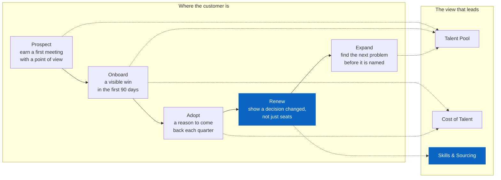

# Talent Market Signal — product requirements

**Status:** v1 shipped · **Owner:** Mateo Portillo · **Last updated:** August 2026

---

## The problem

An account executive is in a renewal conversation with a customer's talent
acquisition leader. The customer says: *"we can't fill our engineering roles."*

The AE has three options today, and all of them are bad:

1. **Sympathise and move on.** The conversation stays about seat count.
2. **Promise to follow up.** Files a request with an analyst, waits a week, and
   by the time the answer arrives the moment has passed.
3. **Guess.** Says something plausible about the market that they cannot source,
   and hopes nobody checks.

The insight that would change that conversation exists in the data. What is
missing is a **repeatable path from the data to the AE's mouth**, fast enough to
be used in the meeting where it matters.

This is not a dashboard problem. Dashboards already exist and go unused. It is a
problem of getting the *right* insight to the *right* moment in the customer
relationship, and then knowing whether it worked.

---

## Who this is for

**Primary user: the field.** Account executives and customer success managers
in the Global Business Organization. They are not analysts. They have four
minutes between meetings. They need one defensible sentence, not a filter panel.

**End beneficiary: the customer's TA leader.** They never touch this tool. They
receive its output secondhand, in a conversation. Which means the output has to
survive being repeated by someone who did not build it — the single hardest
design constraint here, and the reason every view generates a written takeaway
rather than leaving interpretation to the reader.

**Explicit non-user: the data science team.** They have better tools and deeper
access. Building for them would produce a different and worse product.

---

## Jobs to be done, by lifecycle stage

The programme is organised by where the customer is, not by what the data can
do. The same underlying tables answer different questions at each stage, and the
stage determines which one leads.

<!-- diagram: lifecycle-stages -->

**Why organised this way:** the same tables answer all five, so a
feature-organised roadmap would say nothing about *when* to reach for which.
The stage decides which question leads, and that is a programme decision rather
than a data one.

| Stage | The field's job | The insight that serves it | View |
|---|---|---|---|
| **Prospect** | Earn a first meeting with a point of view, not a pitch | "Your market for this role is in the 80th percentile for difficulty nationally" | Talent Pool |
| **Onboard** | Make the first 90 days produce a visible win | "Here is where your open roles are hardest, ranked" | Talent Pool + Cost |
| **Adopt** | Give the customer a reason to come back each quarter | "Your hiring locations cost 22% more than three alternatives with equivalent depth" | Cost of Talent |
| **Renew** | Show the relationship produced a decision, not just seats | "You widened sourcing to two adjacent occupations; here is what that opened up" | Skills & Sourcing |
| **Expand** | Find the next problem before the customer names it | "The pool you rely on shrank 8% while your headcount plan grew" | Talent Pool |

The **renewal stage is the one that matters most** and the one most products get
wrong. A renewal conversation is not about product usage; it is about whether
the customer made a better decision than they would have alone. Skills &
Sourcing is in the product specifically because it produces a *changed action* —
"we started recruiting from QA" — rather than a changed report.

---

## What v1 does

Five views over public U.S. labour-market data.

1. **Talent Pool** — supply, wage distribution and a 0–100 Competition Index for
   every metro, ranked. Answers *where is this hard*.
2. **Cost of Talent** — the annual cost of N hires in each metro against a
   baseline, with a pool-depth guardrail. Answers *what would moving cost*.
3. **Skills & Sourcing** — what distinguishes the role, and the nearest
   occupations by skill profile. Answers *who else could do this job*.
4. **Program Health** — which insights actually get pulled. Answers *is this
   worth continuing*.
5. **About** — sources, method, and what the data cannot tell you.

Every view generates a written takeaway alongside its charts.

### Requirements that shaped the build

| # | Requirement | Why | Where it lives |
|---|---|---|---|
| R1 | Every view produces a sentence a non-analyst can repeat | The end beneficiary never sees the tool | `tms/narrative.py` |
| R2 | No recommendation that the local talent pool cannot support | A cheap, empty market is a worse answer than no answer | `pool_depth` in `sql/wage_arbitrage.sql` |
| R3 | Suppressed and imputed data is visibly marked | A silent gap is indistinguishable from a real zero | `growth_imputed` flag |
| R4 | Numbers reject rather than degrade on bad input | A plausible wrong number is worse than a failed load | `CHECK` constraints in `sql/ddl/schema.sql` |
| R5 | Usage is instrumented from day one | Retrofitting measurement means the first two quarters are unmeasurable | `mart.usage_log` |
| R6 | Analysis is portable SQL, not application code | The warehouse will change; the logic should not have to | `sql/*.sql` |

---

## Explicit non-goals

Naming these is most of the value of writing the document.

**Not a forecasting tool.** Everything here is descriptive. Public data
describes the market that was, not the one a customer is hiring in this quarter.
The moment this predicts, it needs an accuracy story it cannot support.

**Not a sourcing tool.** It tells you a pool exists. It does not find people in
it, and it must not be positioned as if it does.

**Not a compensation benchmark.** Wages here are BLS base wages, with no equity,
bonus, or benefits load. Compensation teams have real benchmarking data;
pretending to compete with it would get the tool correctly distrusted.

**Not company-level.** Public data has no employer dimension. "Who else is
hiring here" is the most-requested thing this cannot answer, and saying so up
front prevents a roadmap built on a promise the data cannot keep.

**Not self-serve for customers.** v1 is an internal tool. The output travels to
customers through a person, deliberately — the interpretation is the value, and
handing over an uninterpreted filter panel gives away the work and keeps the
risk.

---

## Success metrics

| Horizon | Metric | Target | Why this one |
|---|---|---|---|
| Leading | Distinct field users in a 30-day window | 40% of the pilot cohort | Opening it once is the minimum precondition for everything else |
| Leading | Repeat rate (users returning within 30 days) | > 50% | Curiosity produces one visit; usefulness produces the second. This is the honest early signal |
| Lagging | Opportunities with an insight referenced in notes | 25% of pilot opportunities | The first evidence it reached a customer conversation |
| Lagging | Win-rate delta, insight-referenced vs. matched control | Directional only | See [`MEASUREMENT.md`](./MEASUREMENT.md) — this is not cleanly attributable and should not be reported as if it were |
| Guardrail | Corrections issued after publication | Zero | One wrong number in front of a customer costs more trust than ten insights earn |

**Repeat rate is the metric to defend in a review.** Total views can be inflated
by a launch email. Repeat use cannot.

---

## Open questions

1. **Which stage should lead?** The lifecycle table above is a hypothesis. The
   pilot should tell us whether renewal or prospecting produces more pull, and
   the roadmap should follow the answer rather than my guess.
2. **Is the Competition Index trusted or ignored?** A composite score is either
   a useful shorthand or a black box. If the field consistently drills into the
   components rather than quoting the headline, the composite is not earning its
   place.
3. **How much does the missing employer dimension cost us?** If "who else is
   hiring here" is the top unanswered question, that is the argument for the
   next data investment.
4. **Does the written takeaway get repeated verbatim?** If yes, its phrasing is
   a much higher-stakes surface than it currently gets treated as.

---

## What would come next

Ordered by expected value, not by ease.

1. **Employer dimension.** The single biggest gap. H-1B LCA disclosure data
   gives employer × title × wage × location and would answer the most-asked
   question this cannot.
2. **Saved views per account.** Right now every session starts from zero. An AE
   preparing a QBR should open their account's roles, not rebuild the query.
3. **Push, not pull.** The highest-value version of this is not a dashboard
   anyone visits. It is a notification: *"the pool your customer relies on
   shrank 8% this quarter."* Pull tools get used by the already-curious; push
   reaches everyone else.

---

**[← All documentation](./README.md)** · [Project README](../README.md) · Related: [Methodology](./METHODOLOGY.md) · [Measurement](./MEASUREMENT.md)
