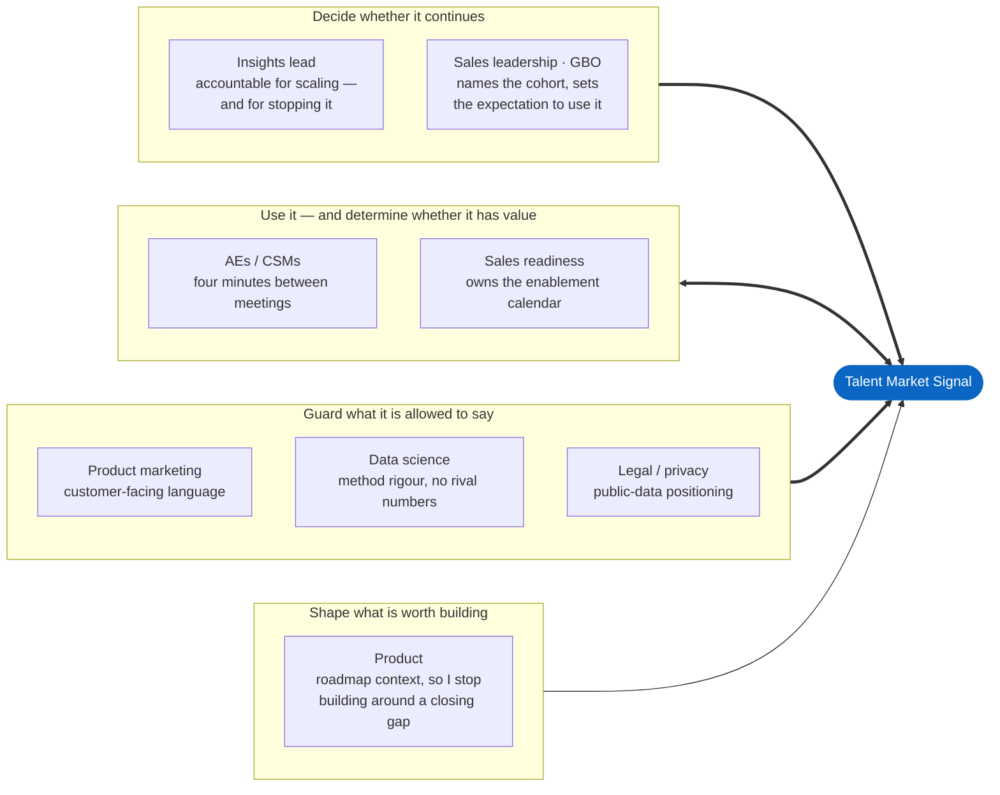

# Stakeholders

**Owner:** Mateo Portillo · **Last updated:** August 2026

Who is involved, what each needs, and where the friction is. The conflicts
section is the useful half — every one of these is predictable, and a programme
that has not thought about them in advance meets them at the worst moment.

---

## The map

Grouped by the relationship rather than the org chart, because that is what
determines how you approach each one.

<!-- diagram: stakeholder-map -->

Only the **Use** relationship runs both ways, and that asymmetry is the job.
Everyone else is consulted, informs, or approves; the field is the only group
whose behaviour is simultaneously the input and the outcome.

| Partner | What they need from me | What I need from them | Cadence |
|---|---|---|---|
| **Sales leadership (GBO)** | Evidence this makes reps more effective, in their language | Pilot cohort, and a public statement that using it is expected | Monthly |
| **Account executives / CSMs** | One defensible sentence, fast. Not a filter panel | Honest friction reports; permission to shadow calls | Weekly office hours |
| **Sales readiness** | Enablement that fits their existing calendar | 45 minutes in a forum that already exists | Per rollout wave |
| **Product marketing** | Positioning consistent with how we already talk about value | Language review before anything customer-facing | Monthly |
| **Product** | Where the tool exposes a product gap | Roadmap context, so I stop building around a gap they are closing | Quarterly |
| **Data science** | Method rigour; no contradicting numbers | Review of the index weights and the adjacency measure | Quarterly |
| **Legal / privacy** | Clear sourcing and defensible claims | Sign-off on public-data positioning | At launch, then on change |

---

## RACI

| Decision | R | A | C | I |
|---|---|---|---|---|
| What gets built next | Me | Insights lead | Sales leadership, Product | Field |
| Method and metric definitions | Me | Data science | PMM | Field |
| Customer-facing language | PMM | PMM | Me, Legal | Field |
| Pilot cohort | Sales leadership | Sales leadership | Me | Readiness |
| Whether to scale | Insights lead | Insights lead | Sales leadership, me | All |
| Killing the programme | Insights lead | Insights lead | Sales leadership | All |

That last row exists on purpose. A programme with no named owner for stopping it
does not stop; it decays while consuming a headcount, which is worse for
everyone than a clean decision.

---

## The four conflicts I would expect

### 1. Sales wants a number the data cannot support

**The shape:** "Can we tell customers which companies are hiring against them?"
Public data has no employer dimension.

**How I would handle it:** Never a flat no. Name what we *can* say, what it
would take to say the rest, and let them decide if it is worth the investment.
"We can't do that with this data. H-1B disclosure filings would get us most of
the way — that is roughly three weeks of work. Is that the highest-value thing I
could do this quarter?"

**Where I would hold:** I will not ship a proxy metric labelled as the real
thing. A number that looks like competitor hiring but is not will be repeated to
a customer as if it were.

### 2. Data science disagrees with the index weights

**The shape:** 50/30/20 across scarcity, wage premium and growth is a judgment
call, not a derived result. Someone with a stronger statistical background will
reasonably want it justified.

**How I would handle it:** Agree immediately, because they are right that it is
a judgment call. The weights are documented with reasoning in
[`METHODOLOGY.md`](./METHODOLOGY.md), the components are exposed in the UI so nobody has to accept
the composite on faith, and I would rather adopt their weighting than defend
mine. The composite exists to be *sayable*, not to be optimal.

**Where I would hold:** The components stay visible in the product. A black-box
score is not more defensible for being better-calibrated.

### 3. PMM wants the language softer than the data supports

**The shape:** "Can we say this shows customers save money?" It shows a wage
differential, not a saving, and it excludes benefits, equity and relocation.

**How I would handle it:** Offer the strongest claim the data actually supports
and let them decide if it is enough. Usually it is — "base wages run 22% lower"
is a real sentence. The disagreement is almost always about precision, not
about whether there is a story.

**Where I would hold:** If a customer can check a claim and find it wrong, it
does not ship. That is not a style preference; it is the guardrail in
[`MEASUREMENT.md`](./MEASUREMENT.md).

### 4. Nobody uses it

**The shape:** The most likely failure, and the one worth planning for. The
tool works, the enablement happened, and the field carries on as before.

**How I would handle it:** Treat it as a diagnosis rather than a verdict, and
distinguish three causes because the response differs:

- **Wrong moment** — useful, but not at hand when it is needed. Fix: push, not
  pull. Bring it to them.
- **Wrong altitude** — too much interpretation asked of the user. Fix: stronger
  generated takeaways, fewer controls.
- **Wrong problem** — the field does not have the problem I assumed. Fix: stop.
  Say so plainly and redirect the effort.

**Where I would hold:** on saying the third one out loud if it is true. An
insights programme that keeps a well-built, unwanted tool alive because it was
expensive to build is the most expensive failure mode available.

---

## Influence without authority

None of these teams report to this role. What actually works:

**Bring them a decision, not a status update.** "Here are two options and what I
would pick" gets a partner in ten minutes. "Here is what I have been working on"
gets a nod and nothing.

**Give the credit away.** The "insight of the month" names the AE, not the
programme. People who get recognised through your tool become its advocates.

**Be the one who says the uncomfortable thing first.** The fastest way to be
trusted with a number is to be the person who volunteered its limitations before
anyone asked. It is also the only way the caveats survive being repeated.

---

**[← All documentation](./README.md)** · [Project README](../README.md) · Related: [Rollout & enablement](./GTM_ENABLEMENT.md) · [Methodology](./METHODOLOGY.md)
